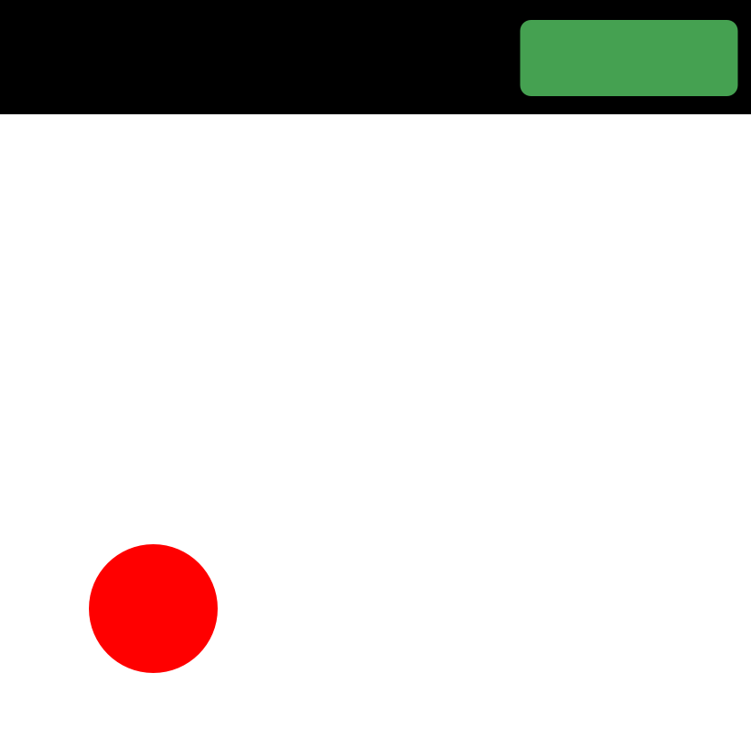
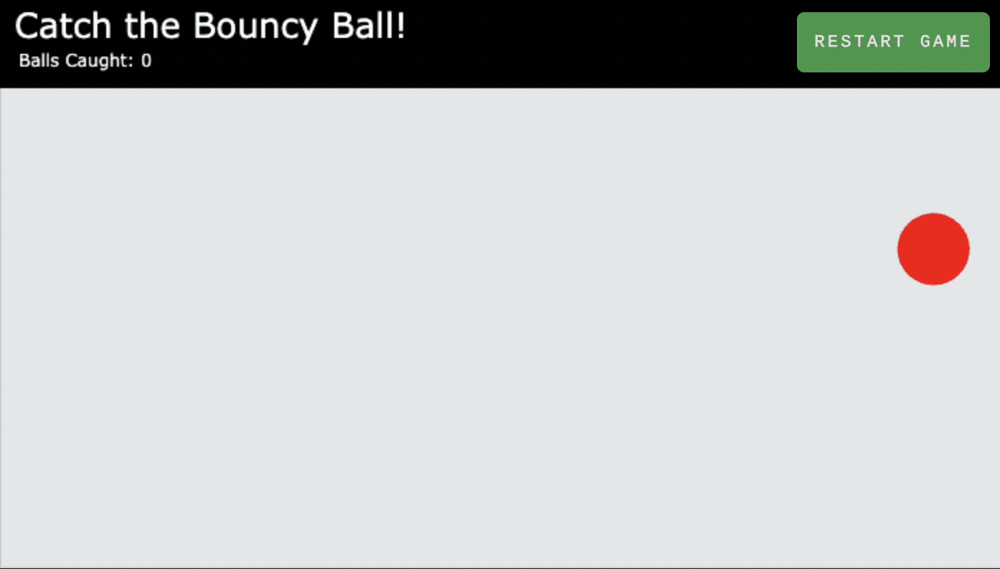

<!-- Begin README -->

    

 

    
    
    
     
    
    
    
     
    

---------------

<h1 align="center">Bouncy Ball Game</h1>

A simple fun web game written using JavaScript, CSS, and HTML.
- Play it on CodePen [here](https://codepen.io/scottgriv/pen/JjBNMaY).

    
     
    <i>Grow your score by catching the bouncy ball!</i>

---------------

## Table of Contents

- [Getting Started](#getting-started)
    - [How to Play](#how-to-play)
- [Resources](#resources)
- [License](#license)
- [Credits](#credits)

## Getting Started

1. Clone the repository to your local machine.
2. Open `src/index.html` in your browser and have fun!

### How to Play

- Click the ball as many times as you can to increase the "caught" counter.
    - Each time you click on the ball, the ball speed will increase, making it more challenging each round.
- Click "Restart Game" to reset the counter and revert to the original ball speed.

## Resources

- [JavaScript](https://www.javascript.com/)
- [HTML](https://www.w3schools.com/html/)
- [CSS](https://www.w3schools.com/css/)
- [CodePen](https://www.codepen.io)

## License

This project is released under the terms of the **MIT License**, which permits use, modification, and distribution of the code, subject to the conditions outlined in the license.
- The [MIT License](https://choosealicense.com/licenses/mit/) provides certain freedoms while preserving rights of attribution to the original creators.
- For more details, see the [LICENSE](LICENSE) file in this repository. in this repository.

## Credits

**Author:** [Scott Grivner](https://github.com/scottgriv)  
**Email:** [scott.grivner@gmail.com](mailto:scott.grivner@gmail.com)  
**Website:** [scottgrivner.dev](https://www.scottgrivner.dev)  
**Reference:** [Main Branch](https://github.com/scottgriv/javascript-bouncy_ball_game)  

---------------

    

<!-- End README -->
